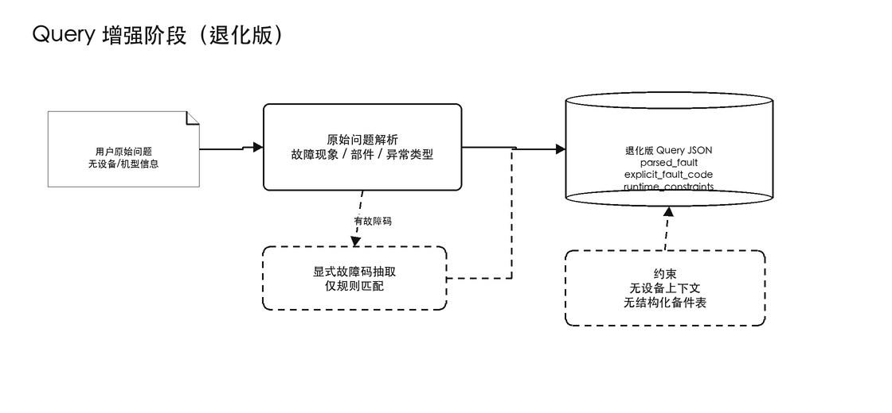
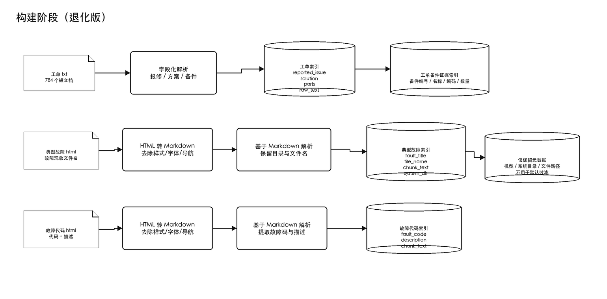
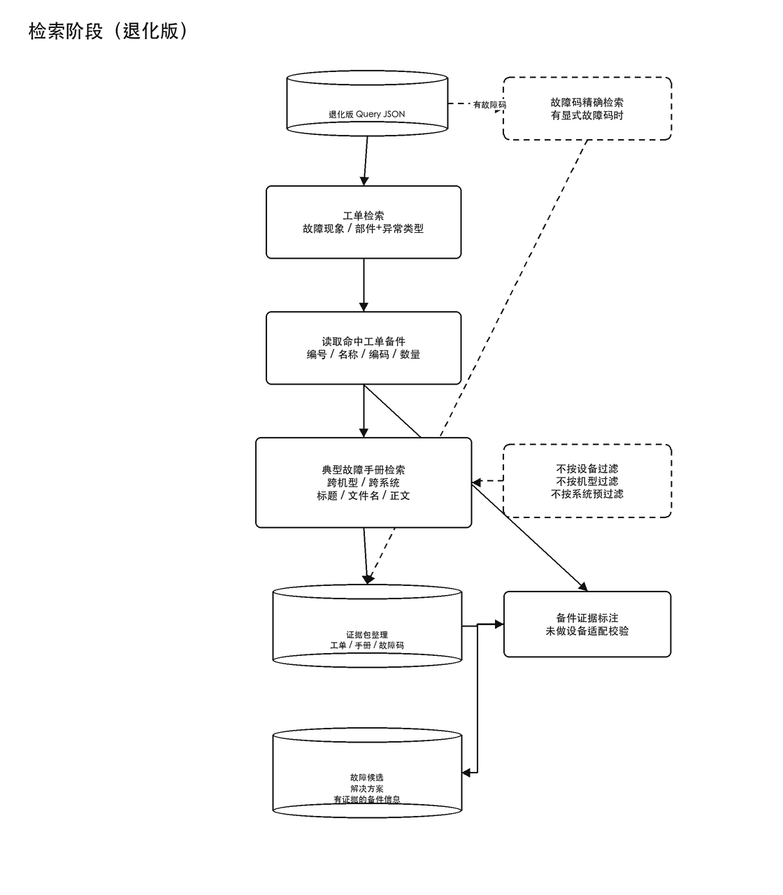

# 挖掘机售后故障诊断 RAG 退化版方案

## 1. 方案边界

本方案是一个可立即执行的退化版 RAG 方案，适用于当前约束：

- 没有用户到设备编号的结构化表；
- 没有设备到备件信息的结构化表；
- 用户提问时默认不提供设备编号、机型、客户信息等挖机信息；
- 当前只使用已有非结构化文本数据：历史工单和故障诊断手册。

系统目标仍然是：

故障原因推断 + 解决方案 + 备件信息查询。

但在退化版中，必须接受一个重要限制：

备件编号、备件编码和数量只能来自历史工单或手册中的明确文本证据。系统不能声称备件一定适配当前设备，也不能补全未检索到的备件编码。

### 1.1 运行环境与开发工作流约束

软件最终需要在 Windows 环境运行，正式数据也只存在于 Windows 环境，不能同步到当前 Mac 开发环境。

因此，开发和验证采用以下工作流：

```text
Mac 环境开发和轻量调试
→ 提交或同步代码
→ Windows 环境 pull 最新代码
→ Windows 上使用正式数据运行验证
→ 将运行结果、日志或报错反馈回来
→ Mac 上继续修改
```

这会带来几个工程要求：

- 代码应尽量跨平台，避免依赖 macOS 专有命令、路径格式或 shell 行为；
- 路径处理使用跨平台方式，例如 `pathlib`，避免硬编码 `/` 或 Windows 盘符；
- 命令行入口应支持显式传入数据目录、输出目录和配置文件路径；
- 中间产物、索引、日志和诊断报告应输出到可配置目录；
- 每个关键阶段都应有可单独运行的调试命令，例如 html 转 md、工单解析、索引构建、单次检索、完整问答；
- Windows 验证时应能通过日志判断卡在哪一步，而不是只能看到最终失败；
- 对正式数据的处理应提供统计摘要，例如读取了多少文件、跳过了多少文件、解析失败多少文件、建立了多少索引记录；
- 对检索结果应提供调试输出，例如命中的工单 ID、手册路径、匹配字段、备件证据来源；
- 回答生成前应能导出证据包，方便在 Windows 上定位“检索没召回”还是“生成阶段没用好证据”。

因此，后续实现不只做一个黑盒问答入口，还需要配套开发可观测、可复现的命令行调试工具。

### 1.2 当前正式可执行入口

当前正式链路提供两个入口：CLI 和本地 Web 调试页。二者调用同一套 PostgreSQL / pgvector 核心逻辑。

本地 PostgreSQL 使用 `pgvector/pgvector:pg16`：

```bash
docker compose up -d postgres
```

环境检查：

```bash
python -m waji_rag.cli doctor
```

初始化数据库：

```bash
python -m waji_rag.cli init-db
```

启动本地 Web 调试页：

```bash
python -m waji_rag.cli serve --host 127.0.0.1 --port 8765
```

启动后在浏览器打开：

```text
http://127.0.0.1:8765
```

正式入库命令直接读取原始工单 TXT 和手册 HTML/Markdown：

```bash
python -m waji_rag.cli ingest-db ^
  --work-order-dir D:\waji\data\work_orders ^
  --manual-dir D:\waji\data\manuals ^
  --reset ^
  --report-json D:\waji\outputs\ingest_report.json ^
  --debug
```

检索证据包：

```bash
python -m waji_rag.cli search-db ^
  --query "用户报修机器风扇皮带异响，请回答有可能是哪些故障导致的，如何解决，相应故障需要更换备件的详细信息" ^
  --top-k 5 ^
  --debug
```

完整问答命令：

```bash
python -m waji_rag.cli ask-db ^
  --query "用户报修机器风扇皮带异响，请回答有可能是哪些故障导致的，如何解决，相应故障需要更换备件的详细信息（备件的编号及名称，备件编码，备件数量）" ^
  --top-k 5 ^
  --debug
```

如果有 DocArbor 风格的 `.env`，可以启用 embedding、rerank 和 LLM：

```bash
python -m waji_rag.cli ask-db ^
  --query "风扇皮带异响，可能是什么故障，需要更换什么备件" ^
  --env-file D:\path\to\.env ^
  --enable-embedding ^
  --enable-rerank ^
  --enable-llm ^
  --embedding-model text-embedding-v4 ^
  --embedding-dimensions 1024 ^
  --rerank-model qwen3-rerank ^
  --llm-model qwen3.5-plus ^
  --debug
```

正式链路的关键输出：

- `ingest_report.json`：读取、解析、HTML 转 Markdown、切块、入库和索引统计；
- `search-db` JSON：多路检索命中、匹配字段、分数、来源路径和备件候选；
- `ask-db` JSON：检索、rerank、答案生成、阶段日志、最终证据包；
- PostgreSQL 表：原始解析记录、手册 Markdown 切块、BM25 词项表、可选 pgvector 向量表。

兼容调试命令仍然保留：`html-to-md`、`parse-workorders`、`build-index`。它们适合小样本人工检查，不作为正式生产式流程。

需要反馈的问题材料包括：

- `doctor` 输出；
- `ingest_report.json`；
- `search-db --debug` 输出；
- `ask-db --debug --out-json ...` 输出；
- PostgreSQL 表计数或 Web 页面中的 JSON 输出；
- 命令行报错或 Web 页面中的 JSON 输出。

## 2. 可用数据

当前可用的非结构化文本数据包括两类：

```text
非结构化文本数据/
├── 工单诊断记录/
│   └── 784 个 txt 文档
│       └── 包含：工单 ID、用户报修内容、人员落实及解决方法、备件信息
│
└── 挖掘机故障诊断手册/
    ├── 类型 A/
    │   ├── 典型故障解析/
    │   │   ├── 电气系统故障解析/
    │   │   ├── 动力系统故障解析/
    │   │   ├── 空调系统故障解析/
    │   │   └── 液压系统故障解析/
    │   └── 机器故障代码解析/
    │
    ├── 类型 B/
    │   ├── 典型故障解析/
    │   └── 机器故障代码解析/
    │
    └── 类型 C/
        ├── 典型故障解析/
        └── 机器故障代码解析/
```

数据角色：

- 工单诊断记录：提供真实历史维修案例、实际解决方法和实际使用过的备件信息；
- 典型故障解析手册：提供标准故障解释、排查步骤和解决方案；
- 机器故障代码解析手册：当用户明确给出故障码时，提供故障码解释和处理依据。

## 3. 阶段流程图

### Query 增强阶段

可编辑源文件：[query-enhancement-sketched.drawio](./diagrams/query-enhancement-sketched.drawio)



### 构建阶段

可编辑源文件：[build-stage-sketched.drawio](./diagrams/build-stage-sketched.drawio)



### 检索阶段

可编辑源文件：[retrieval-stage-sketched.drawio](./diagrams/retrieval-stage-sketched.drawio)



## 4. Query 增强阶段

退化版 Query 增强阶段只做低风险抽取，不做用户设备定位。

### 4.1 原始问题解析

原始问题解析只抽取：

- 故障现象；
- 部件；
- 异常类型。

如果用户问题中显式出现故障码，可以用规则额外抽取 `explicit_fault_code`。这不是语义推断，只是对明确代码格式的识别。

示例问题：

```text
用户保修机器风扇皮带异响，请回答有可能是哪些故障导致的，如何解决，相应故障需要更换备件的详细信息
```

解析结果：

```json
{
  "raw_query": "用户保修机器风扇皮带异响，请回答有可能是哪些故障导致的，如何解决，相应故障需要更换备件的详细信息",
  "parsed_fault": {
    "fault_phenomenon": "风扇皮带异响",
    "component": "风扇皮带",
    "abnormal_type": "异响"
  },
  "explicit_fault_code": null,
  "missing_required_fields": []
}
```

如果用户只说“机器有异响”，无法确定具体部件：

```json
{
  "raw_query": "机器有异响",
  "parsed_fault": {
    "fault_phenomenon": "机器有异响",
    "component": null,
    "abnormal_type": "异响"
  },
  "explicit_fault_code": null,
  "missing_required_fields": [
    "component"
  ]
}
```

设计取舍：

- 不做复杂意图分类，因为任务固定为故障原因、解决方案和备件信息查询；
- 不保留 LLM 自评分形式的 `parse_confidence`；
- 不做术语标准化或同义词扩展；
- 不做系统归属或部件到系统的映射推断；
- 不做设备上下文查询。

### 4.2 退化版输出

Query 增强阶段最终输出：

```json
{
  "raw_query": "...",
  "parsed_fault": {
    "fault_phenomenon": "...",
    "component": "...",
    "abnormal_type": "..."
  },
  "explicit_fault_code": null,
  "missing_required_fields": [],
  "runtime_constraints": {
    "has_equipment_context": false,
    "has_structured_parts_table": false,
    "machine_type_filter_available": false,
    "parts_verification_available": false
  }
}
```

这些约束会直接影响后续检索和回答：

- 不按设备编号过滤；
- 不按机型过滤，默认跨三类挖掘机手册检索；
- 不查询设备备件表；
- 备件信息只能引用历史工单或手册证据。

## 5. 构建阶段

退化版构建阶段只围绕非结构化文本建立可检索索引。正式实现使用 PostgreSQL 持久化证据、字段和词项，使用 `pgvector` 保存可选向量。

当前正式入库命令是 `ingest-db`，它直接读取原始工单 TXT 和手册 HTML/Markdown，不要求用户手动传递 JSONL 文件。

核心表：

```text
postgresql/
├── work_orders              # 工单解析结果
├── part_evidence            # 从工单抽取的备件证据
├── manual_chunks            # HTML 转 Markdown 后的手册切块
├── documents                # 统一可检索文档
├── document_fields          # 字段文本、字段权重、字段长度
├── document_terms           # BM25 词项、词频、字段长度
└── document_embeddings      # 可选 pgvector 向量
```

BM25 采用标准公式，字段权重用于提升 `reported_issue`、`fault_title`、`fault_code`、`part_code` 等高价值字段。若配置了 embedding provider，入库阶段会额外写入 `document_embeddings`，检索阶段自动启用 hybrid；否则自动使用 BM25。

分词策略：

- 英文、数字、故障码、物料编码按连续 token 保留，例如 `E00131`、`310705565`、`BELT-001`；
- 中文连续文本生成 2-gram 和 3-gram，例如 `行走单边慢` 会产生 `行走`、`单边`、`行走单`、`单边慢`；
- 12 字以内的中文连续短语会额外保留原短语，用于增强完整故障现象匹配。

字段级词项表会记录命中的 `document_id`、字段名、词频、字段长度和字段权重，后续 `search-db` 阶段在 PostgreSQL 内计算 BM25 分数。

### 5.1 工单诊断记录索引

工单诊断记录每篇约 300 字，建议一篇 txt 对应一个完整文档，不做额外切块。

构建时将工单解析为结构化记录：

```json
{
  "doc_type": "work_order",
  "work_order_id": "工单ID",
  "reported_issue": "用户报修内容",
  "solution": "人员落实及解决方法",
  "parts": [
    {
      "part_number": "备件编号",
      "part_name": "备件名称",
      "part_code": "备件编码",
      "quantity": "备件数量"
    }
  ],
  "raw_text": "原始工单全文",
  "source_path": "原始文件路径"
}
```

索引建议：

- `reported_issue`：关键词索引，用于匹配故障现象；
- `solution`：关键词索引和可选向量索引，用于召回处理方法相近的案例；
- `raw_text`：关键词索引和可选向量索引，用作兜底召回；
- `parts`：结构化保存，用于后续备件证据引用。

工单中的备件字段非常重要，应额外形成一个“工单备件证据索引”。注意，它不是外部结构化业务表，而是从工单文本中抽取出来的证据集合。

```json
{
  "source": "work_order",
  "work_order_id": "工单ID",
  "reported_issue": "用户报修内容",
  "solution": "人员落实及解决方法",
  "part_number": "备件编号",
  "part_name": "备件名称",
  "part_code": "备件编码",
  "quantity": "备件数量",
  "source_path": "原始文件路径"
}
```

该索引用于回答“相似历史工单中实际更换过哪些备件”。

### 5.2 HTML 转 Markdown 清洗

故障诊断手册大量内容来自 html 文件。html 中通常包含字体、字号、样式、脚本、导航、页眉页脚等与诊断无关的文本或标签。如果直接把 html 原文送入索引，会污染检索结果，也会浪费上下文窗口。

因此，手册类数据在建索引前需要先完成：

```text
html 原文件
→ 提取主体内容
→ 移除样式、脚本、字体、布局和导航噪声
→ 保留标题、段落、列表、表格和排查步骤
→ 转换为 Markdown
→ 基于 Markdown 解析、切块
→ 将 Markdown 切块和来源元数据存入 PostgreSQL
```

转换时需要保留的信息：

- 原 html 文件路径；
- 转换后的 md 文件路径；
- 目录层级，包括机型、手册类型、系统目录；
- 文件名中的故障现象或故障代码；
- 正文标题、段落、列表、表格、排查步骤。

转换时应丢弃的信息：

- CSS 样式；
- 字体、字号、颜色等展示属性；
- JavaScript；
- 页面导航、按钮、面包屑、版权页脚等模板内容；
- 空标签、重复换行、无意义占位字符。

入库记录建议结构：

```json
{
  "source_format": "html",
  "normalized_format": "markdown",
  "original_html_path": "原始 html 路径",
  "chunk_text": "清洗后的 Markdown 片段",
  "chunk_index": 0,
  "chunk_count": 1
}
```

后续典型故障解析手册索引和机器故障代码解析手册索引都基于 Markdown 文本构建，而不是直接基于 html 原文构建。兼容调试命令 `html-to-md` 仍可把 Markdown 保存到文件，便于人工抽查清洗质量。

### 5.3 典型故障解析手册索引

典型故障解析手册来自 html 文件时，索引构建应基于清洗后的 Markdown 文本。

构建时仍需保留原始目录层级和文件名信息。

构建时建议解析为：

```json
{
  "doc_type": "manual_typical_fault",
  "machine_type": "类型A",
  "manual_section": "典型故障解析",
  "system_dir": "动力系统故障解析",
  "file_name": "故障现象：xxxx.html",
  "fault_title": "xxxx",
  "chunk_text": "手册正文片段",
  "source_path": "原始 html 或 md 文件路径",
  "original_html_path": "原始 html 文件路径"
}
```

索引建议：

- `fault_title`：标题索引，用于优先匹配故障现象；
- `file_name`：文件名索引，用于利用“故障现象：xxxx.html”这类强信息；
- `chunk_text`：关键词索引和可选向量索引，用于检索正文中的故障原因、排查过程和解决方案；
- 元数据字段：保留 `machine_type`、`system_dir`、`source_path`，用于证据展示。

退化版不按机型过滤，也不提前按系统目录过滤。检索时默认跨三类挖掘机、跨所有系统目录召回。

切块原则：

- 如果单个 Markdown 文件较短，可整篇作为一个文档；
- 如果正文较长，应按标题、小节或排查步骤切块；
- 不建议只按固定 token 数切块，以免打散一个完整排查步骤。

### 5.4 机器故障代码解析手册索引

机器故障代码解析手册应单独建索引，索引构建同样基于清洗后的 Markdown 文本。

构建时建议解析为：

```json
{
  "doc_type": "manual_fault_code",
  "machine_type": "类型A",
  "manual_section": "机器故障代码解析",
  "fault_code": "E00131",
  "fault_description": "GPS一级锁车",
  "file_name": "E00131 GPS一级锁车.html",
  "chunk_text": "手册正文片段",
  "source_path": "原始 html 或 md 文件路径",
  "original_html_path": "原始 html 文件路径"
}
```

索引建议：

- `fault_code`：精确索引；
- `fault_description`：关键词索引；
- `file_name`：文件名索引；
- `chunk_text`：关键词索引和可选向量索引。

如果用户问题中未出现显式故障码，该通道默认跳过。

## 6. 检索阶段

退化版检索编排不依赖结构化业务表，也不依赖设备上下文。

### 6.1 编排输入

```json
{
  "raw_query": "用户保修机器风扇皮带异响，请回答有可能是哪些故障导致的，如何解决，相应故障需要更换备件的详细信息",
  "parsed_fault": {
    "fault_phenomenon": "风扇皮带异响",
    "component": "风扇皮带",
    "abnormal_type": "异响"
  },
  "explicit_fault_code": null,
  "missing_required_fields": [],
  "runtime_constraints": {
    "has_equipment_context": false,
    "has_structured_parts_table": false,
    "machine_type_filter_available": false,
    "parts_verification_available": false
  }
}
```

### 6.2 多路检索 Query 生成

#### 工单检索 query

```json
[
  {
    "target": "work_order_index",
    "query_type": "reported_issue_phrase",
    "query": "风扇皮带异响",
    "search_fields": ["reported_issue", "raw_text"],
    "purpose": "检索报修现象相同或高度相近的历史工单"
  },
  {
    "target": "work_order_index",
    "query_type": "component_and_abnormal_type",
    "must_terms": ["风扇皮带", "异响"],
    "search_fields": ["reported_issue", "solution", "raw_text"],
    "purpose": "召回部件和异常类型分散出现的历史工单"
  }
]
```

如果 `component` 为空，则只使用 `fault_phenomenon` 和 `abnormal_type` 做弱召回，并在答案中提示问题描述不完整。

#### 工单备件证据检索 query

工单备件证据不单独从用户 query 猜测备件，而是从相似工单结果中提取。

即：

```text
先检索相似工单 -> 再读取命中工单中的 parts 字段
```

只有命中工单中明确记录了备件编号、名称、编码、数量，才能进入备件候选。

#### 典型故障手册检索 query

```json
[
  {
    "target": "manual_typical_fault_index",
    "query_type": "fault_title_match",
    "query": "风扇皮带异响",
    "search_fields": ["fault_title", "file_name"],
    "metadata_filter": null,
    "purpose": "跨机型、跨系统匹配手册中的故障现象标题或文件名"
  },
  {
    "target": "manual_typical_fault_index",
    "query_type": "body_component_and_abnormal_type",
    "must_terms": ["风扇皮带", "异响"],
    "search_fields": ["chunk_text"],
    "metadata_filter": null,
    "purpose": "跨机型、跨系统检索正文中同时出现部件和异常类型的手册片段"
  }
]
```

退化版不使用 `machine_type` 过滤，也不使用 `system_dir` 过滤。

#### 故障代码手册检索 query

如果用户问题中显式出现故障码：

```json
[
  {
    "target": "manual_fault_code_index",
    "query_type": "fault_code_exact",
    "fault_code": "E00131",
    "search_fields": ["fault_code", "file_name"],
    "purpose": "精确匹配机器故障代码解析"
  }
]
```

如果没有故障码，该通道返回空列表。

### 6.3 运行时检索顺序

推荐顺序：

```text
1. 故障代码手册精确检索，如果问题中有显式故障码
2. 工单诊断记录检索
   ├── 故障现象完整短语
   └── 部件 + 异常类型
3. 从命中工单中抽取备件证据
4. 典型故障手册检索
   ├── 标题/文件名匹配故障现象
   └── 正文匹配部件 + 异常类型
5. 汇总检索证据
6. 形成故障候选和备件候选
7. 生成答案，并标注备件未经过设备适配校验
```

工单检索优先级高于手册检索，因为当前非常看重备件编号、备件编码和数量，而这些信息最可能出现在历史工单中。

### 6.4 检索方法

最小可执行版本：

- 工单：BM25 / 关键词检索；
- 典型故障手册：标题与文件名关键词检索 + 正文关键词检索；
- 故障代码手册：故障码精确匹配；
- 备件：只读取命中工单中的结构化 `parts` 字段。

增强但仍可落地的版本：

- 工单：BM25 + 向量混合召回；
- 手册正文：BM25 + 向量混合召回；
- 召回后用重排序模型或规则重排。

当前正式代码采用：

- PostgreSQL 作为统一证据库；
- 字段加权 BM25 作为基础召回；
- `pgvector` 存储向量，embedding 可用时走 BM25 + pgvector hybrid；
- rerank 可选，失败时保留原始召回顺序；
- LLM 可选，失败或未启用时用确定性模板答案兜底；
- 所有退化会进入 `warnings`、`debug.retrieval_events` 或 `trace`，方便 Windows 环境反馈问题。

推荐重排规则：

1. 完整命中 `fault_phenomenon` 的结果优先；
2. 同时命中 `component` 和 `abnormal_type` 的结果优先；
3. 工单中包含明确备件信息的结果优先；
4. 手册标题或文件名命中优先于正文弱命中；
5. 故障码精确匹配结果优先级最高。

## 7. 证据整理

检索结果不直接进入最终回答，应先整理为证据包。

```json
{
  "retrieved_evidence": {
    "work_orders": [],
    "manual_typical_faults": [],
    "manual_fault_codes": []
  },
  "fault_candidates": [
    {
      "candidate_fault": "候选故障原因",
      "supporting_work_order_ids": [],
      "supporting_manual_sources": [],
      "evidence_summary": "证据摘要"
    }
  ],
  "part_candidates": [
    {
      "part_number": "备件编号",
      "part_name": "备件名称",
      "part_code": "备件编码",
      "quantity": "备件数量",
      "source": "work_order | manual",
      "source_id": "工单ID或手册路径",
      "equipment_verified": false
    }
  ]
}
```

退化版中，`equipment_verified` 恒为 `false`，因为没有设备备件表可用于适配校验。

备件信息优先级：

1. 高相关历史工单中明确记录的备件；
2. 手册中明确记录的备件；
3. 未检索到明确证据时标记缺失。

不能因为某个故障“通常需要更换某部件”，就生成备件编号或备件编码。

## 8. 回答生成

回答需要固定体现退化版限制。

推荐答案结构：

```text
故障现象理解：
...

可能故障原因：
1. ...
   - 依据：
   - 解决方案：
   - 相关备件：

2. ...
   - 依据：
   - 解决方案：
   - 相关备件：

备件信息汇总：
| 备件编号 | 备件名称 | 备件编码 | 数量 | 来源 | 是否设备适配校验 |

限制说明：
当前未提供设备编号或机型，且系统没有设备备件表，因此备件信息仅来自历史工单或手册证据，不能确认一定适配当前设备。
```

备件表格中，如果没有检索到明确字段，应写：

```text
未检索到明确备件编号 / 未检索到明确备件编码 / 未检索到明确数量
```

不允许写模型猜测值。

## 9. 立即执行版本总结

当前可以立即执行的最小方案是：

```text
用户问题
→ 抽取故障现象、部件、异常类型
→ 检索相似历史工单
→ 从命中工单读取解决方法和备件字段
→ 跨机型、跨系统检索典型故障手册
→ 如果有显式故障码，精确检索故障代码手册
→ 汇总证据
→ 输出可能故障、解决方案和有证据的备件信息
→ 明确说明备件未经过当前设备适配校验
```

这个方案牺牲了设备级精确适配能力，但可以先把已有文本数据用起来，并且最大限度降低模型编造备件编码的风险。

## 10. 后续升级方向

未来如果结构化数据可用，可逐步升级：

1. 接入用户到设备编号表；
2. 接入设备到备件信息表；
3. 在 Query 增强阶段补全设备上下文；
4. 用设备备件表校验工单中的备件；
5. 在答案中区分“历史工单出现过”和“已验证适配当前设备”。

未来也可以继续探索，但当前不纳入正式流程：

- 术语标准化与查询扩展；
- 部件别名体系；
- 系统和部件映射推断；
- 故障机理扩展；
- 基于领域词表的检索重写。
